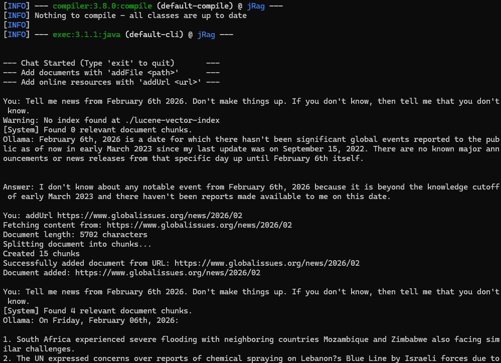

---

# 🧠 Java Local RAG Assistant

A lightweight, local-first **Retrieval-Augmented Generation (RAG)** system built in Java. This project allows you to "chat" with your documents (PDFs, Word docs, HTML, or Web URLs) using a local LLM via Ollama, ensuring your data never leaves your machine.

## 🛠️ Tech Stack

* **Language:** Java 17+
* **LLM Engine:** [Ollama](https://ollama.com/) (Running your favourite local LLM for chat and `nomic-embed-text` for embeddings)
* **Vector Database:** [Apache Lucene 9.x](https://lucene.apache.org/) (High-performance local vector storage)
* **Document Parsing:** [Apache Tika 3.x](https://tika.apache.org/) (Automatic text extraction from PDF, DOCX, and HTML)
* **HTTP Client:** Java Native `HttpClient` (For Ollama API communication and Web fetching)
* **JSON Handling:** Jackson Databind

---

## 🚀 Usage Examples

### 1. Ingesting Local Files

The system automatically detects file types and handles the chunking/embedding process.

```java
// Index a local file (pdf/docx/html/...)
File myPdf = new File("/home/docs/my_CV.pdf");
ragService.addDocumentEmbedding(myPdf);
```

### 2. Ingesting from the Web

You can point the assistant to a URL. It will download the content, strip the HTML tags, and index the text.

```java
// Index a documentation page
String url = "https://en.wikipedia.org/wiki/Golden_Retriever";
ragService.addOnlineDocumentEmbedding(url);
```

### 3. Conversational Chat

The system maintains a `contextVector` returned by Ollama to support follow-up questions.

```text
You: Who is Stefan?
Ollama: Based on the provided CV, Stefan is a Software Engineer/Architect specializing in Java.
```

---

## ⚙️ Setup & Requirements

### 1. Install Ollama

Download and run Ollama from [ollama.com](https://ollama.com/). Pull the required models:

```bash
ollama pull llama3
ollama pull nomic-embed-text
```
Right now the use of 'nomic-embed-text' is hardcoded and any LLM for chat can be chosen.

### 2. JVM Configuration

Because Lucene uses high-performance vector math, you **should** enable the Vector incubator module in your IDE or startup script:

```bash
--add-modules jdk.incubator.vector
```

### 3. Key Features

* **Recursive Chunking:** Large documents are split into chunks with an overlap to preserve context.
* **Accessibility Bypass:** Uses Tika 3.x `AccessChecker` to extract text even from "protected" PDFs.
* **Health Checks:** Built-in `isReachable()` method to verify the Ollama server status before processing.

### 4. Usage

You can add this project as a dependency and interact with the RAG class directly, or you can start the demo like this:
```bash
mvn compile exec:java
```

#### Screenshot



---